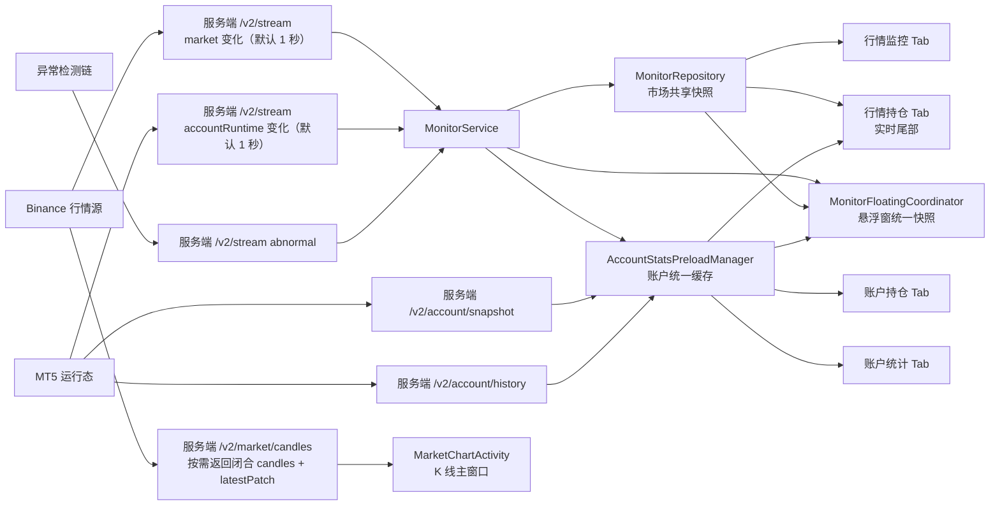

# APP 数据更新机制梳理（以 BTCUSDT 为例）

## 1. 说明

本文只基于当前仓库代码梳理，不把线上运行环境差异当成已确认事实。

本次梳理范围：

- 悬浮窗
- 行情监控
- 行情持仓
- 账户持仓
- 账户统计

这里用 `BTCUSDT` 举例，`XAUUSDT` 走的是同一套机制，只是产品代码不同。

---

## 2. 先看总判断

当前 APP 不是“五个页面各拉各的”，而是两条主链分工：

- 市场主链：服务端 `/v2/stream` 每 `1 秒` 推送一次总线消息；APP 由 `MonitorService` 消费后写入 `MonitorRepository`
- 账户主链：运行态优先走 `/v2/stream` 里的 `accountRuntime` 增量；历史只在 `historyRevision` 前进时补拉 `/v2/account/history`；页面主动刷新或交易后强一致确认时，再显式调用 `/v2/account/snapshot + /v2/account/history`

换句话说：

- 悬浮窗、行情监控页，主要吃“服务层已经整理好的共享快照”
- 行情持仓页，是“REST K 线主链 + Repository 实时尾部 + 账户叠加层”三条链并行
- 账户持仓页、账户统计页，页面显示都以 `AccountStatsPreloadManager.Cache` 为统一账户真值入口

---

## 3. 数据源头总表

| 数据类别 | 直接源头 | 服务端出口 | APP 内第一站 | 备注 |
| --- | --- | --- | --- | --- |
| BTCUSDT 最新价、分钟尾部 | Binance 行情 | `/v2/stream` 的 `market` 变化 | `MonitorService -> MonitorRepository` | 默认 1 秒节拍 |
| BTCUSDT 闭合 K 线窗口 | Binance 行情 | `/v2/market/candles` | `MarketChartActivity` | 返回 `candles + latestPatch` |
| 当前账户运行态（持仓/挂单/概览） | MT5 账户轻快照 | `/v2/stream.accountRuntime`、`/v2/account/snapshot` | `AccountStatsPreloadManager` | 运行态优先走 stream |
| 历史成交、净值曲线、统计指标 | MT5 历史快照 | `/v2/account/history` | `AccountStatsPreloadManager` | 当前服务端实际是一次性全量返回，`nextCursor=""` |
| 异常记录/异常告警 | 服务端异常检测链 | `/v2/stream.abnormal` | `MonitorService -> AbnormalRecordManager` | 监控页本地还会 30 秒重排一次列表 |

---

## 4. 总更新链条图

---

## 5. 悬浮窗

### 5.1 显示了什么

- BTCUSDT 当前价
- BTCUSDT 分钟成交量、成交额
- BTCUSDT 当前聚合盈亏
- BTCUSDT 当前聚合总手数
- 悬浮窗整体连接状态

### 5.2 更新机制

| 数据项 | 数据源头 | 数据链条 | 更新频次 | 更新方式 | 更新时间口径 | 触发机制 |
| --- | --- | --- | --- | --- | --- | --- |
| BTCUSDT 当前价、量、额 | `/v2/stream.market` | `MonitorService -> MonitorRepository(displayPrices/displayOverviewKlines) -> MonitorFloatingCoordinator -> FloatingPositionAggregator -> FloatingWindowManager` | 服务端默认 1 秒节拍；前台/后台都按 1 秒节流刷新 | 增量推送 | 卡片 `updatedAt` 取该产品最新闭合分钟 K 线时间 | stream 出现市场变化；或服务启动/配置刷新/前后台切换时主动刷新 |
| BTCUSDT 聚合盈亏、总手数 | `/v2/stream.accountRuntime` 为主，`AccountStatsPreloadManager.Cache` 为正式兜底真值 | `MonitorService -> stream 持仓快照 + AccountStatsPreloadManager.Cache -> MonitorFloatingCoordinator.resolveFloatingPositions -> FloatingPositionAggregator` | 跟随账户运行态变化；若历史修订号前进，再补一次历史 | 运行态增量 + 历史按 revision 补拉；不是每次都全量 | 悬浮窗总更新时间取“行情卡片时间”和“stream 持仓更新时间”的较大者 | stream 账户变化、历史 revision 前进、页面主动 `fetchForUi(ALL)`、远程会话恢复、登录/登出 |

### 5.3 关键特点

- 悬浮窗不是分别读多个控件数据，而是先拼成一份 `FloatingWindowSnapshot`，再一次性刷新，目的是避免“价格先变、持仓后变”造成画面不一致
- 当前“总手数”已经按同一产品下所有持仓的绝对手数求和显示，正负号按净方向决定
- 当 stream 短暂给出空持仓时，不会立刻判成“无持仓”，而是先和正式账户缓存比对是否追平

---

## 6. 行情监控 Tab

### 6.1 显示了什么

- 连接状态
- 最后更新时间
- BTCUSDT 当前价
- BTCUSDT 开盘价、收盘价、成交量、成交额、涨跌额、涨跌幅
- 异常记录列表

### 6.2 更新机制

| 数据项 | 数据源头 | 数据链条 | 更新频次 | 更新方式 | 更新时间口径 | 触发机制 |
| --- | --- | --- | --- | --- | --- | --- |
| 连接状态 | `GatewayV2StreamClient` 连接状态 | `MonitorService -> MonitorRepository.connectionStatus -> MainViewModel -> MainActivity` | 连接状态变化时更新 | 状态推送 | 无独立时间戳 | websocket 连接、断开、重连 |
| BTCUSDT 当前价 | `/v2/stream.market` | `MonitorService.applyMarketSnapshotFromStream -> MonitorRepository.displayPrices -> MainActivity` | 默认 1 秒节拍 | 增量推送 | `MonitorRepository.lastUpdateTime` 为系统写入时间 | stream 市场变化 |
| 开/收/量/额/涨跌/涨跌幅 | `/v2/stream.market` 中最新闭合分钟数据 | `MonitorService -> MonitorRepository.displayOverviewKlines -> MainActivity.renderMarket` | 默认 1 秒节拍 | 增量推送 | 同上；展示值来自最新闭合分钟 K 线 | stream 市场变化 |
| 最后更新时间文案 | `MonitorRepository.lastUpdateTime` | `MonitorRepository -> MainActivity` | 底层时间戳在市场变化时更新；页面文案每 1 秒重算一次 | 时间戳写入 + 本地 ticker | 显示的是“距离上次更新多久/何时更新” | 市场变化后写入一次；页面常驻 1 秒刷新文案 |
| 异常记录列表 | `/v2/stream.abnormal` + 本地记录库 | `MonitorService -> AbnormalRecordManager -> MainActivity` | 有异常变化时即时更新；页面每 30 秒本地重排一次 | 增量推送 + 本地重排 | 记录自己的发生时间 | stream abnormal 变化；页面 30 秒重排 |

### 6.3 关键特点

- 行情监控页本身基本是“观察者”，不自己主动打市场 REST
- 页面里“当前价”和“开收量额”不是一条接口各自拉来的，而是直接消费服务层已经整理好的共享快照

---

## 7. 行情持仓 Tab

### 7.1 显示了什么

- BTCUSDT 主 K 线窗口
- 实时尾部
- 图上历史成交标注
- 图上当前持仓标注、挂单标注、聚合成本线
- 图右下/底部的当前持仓与挂单面板
- 自动刷新状态

### 7.2 更新机制

| 数据项 | 数据源头 | 数据链条 | 更新频次 | 更新方式 | 更新时间口径 | 触发机制 |
| --- | --- | --- | --- | --- | --- | --- |
| 主 K 线历史窗口 | `/v2/market/candles` | `MarketChartActivity -> GatewayV2Client.fetchMarketSeries*()` | 进入页面、切产品、切周期、左滑补历史、恢复前台需要时 | `SKIP / INCREMENTAL / FULL` 三档 | 以窗口最后一根 K 线时间为主 | 冷启动、切 Tab 返回、定时自动刷新、手动重试、左滑分页 |
| 实时分钟尾部 | `/v2/stream.market` 进入 `MonitorRepository.displayKlines` | `MonitorRepository -> MarketChartActivity.observeRealtimeDisplayKlines -> applyRealtimeChartTail` | 有市场变化就更新；默认 1 秒节拍 | 增量尾部覆盖，不重拉整窗 | 以最新分钟尾部 K 线时间为准 | stream 市场变化 |
| 图上持仓/挂单/历史成交/均价线 | `AccountStatsPreloadManager.Cache` | `AccountStatsPreloadManager -> MarketChartActivity.accountCacheListener -> ChartOverlaySnapshotFactory -> KlineChartView` | 跟随账户缓存变化 | 缓存增量重建叠加层；不是单独再打图表接口 | 叠加层右上角“更新时间”来自账户缓存 `updatedAt/fetchedAt` | stream 账户变化、历史补拉完成、页面主动 `fetchForUi(ALL)`、交易后强一致刷新 |
| 当前持仓/挂单面板 | 同上 | `AccountStatsPreloadManager.Cache -> MarketChartActivity` | 同上 | 跟随账户缓存重绘 | 同上 | 同上 |
| 自动刷新节奏 | 本地策略 | `MarketChartRefreshHelper` | 实时链健康时约 15 秒一次；不健康时回到 1 秒；无实时尾部时对齐到下一分钟边界 | 不是数据源，是刷新策略 | 无 | 页面进入前台后启动 |

### 7.3 全量/增量判定规则

- `SKIP`：本地窗口完整，且最近分钟尾部仍在 `95 秒` 新鲜期内，可直接跳过 REST
- `INCREMENTAL`：本地已有完整窗口，但尾部需要补齐，从最后一根之后增量请求
- `FULL`：本地没有足够窗口、序列断档、或窗口过旧时，重拉整窗

### 7.4 关键特点

- 图表页是全 APP 最复杂的一页，因为它同时吃三条链：`REST K 线主链`、`Repository 实时尾部`、`账户叠加层`
- 周/月/年这类长周期，不直接拿实时分钟尾部硬改整窗，而是等正式聚合或正式请求

---

## 8. 账户持仓 Tab

### 8.1 显示了什么

- 概览指标
- 当前持仓列表
- 当前挂单列表
- 更新时间
- 连接状态

### 8.2 更新机制

| 数据项 | 数据源头 | 数据链条 | 更新频次 | 更新方式 | 更新时间口径 | 触发机制 |
| --- | --- | --- | --- | --- | --- | --- |
| 概览指标、当前持仓、当前挂单 | `AccountStatsPreloadManager.Cache` | `AccountStatsPreloadManager -> AccountPositionActivity.CacheListener -> AccountPositionUiModelFactory -> 页面绑定` | 跟随账户缓存变化 | 统一缓存增量更新 | 页面显示的更新时间来自缓存里的更新时间 | stream 账户变化、历史补拉完成、页面主动强刷 |
| 首次恢复显示 | 本地持久化账户缓存 | `AccountPositionActivity -> preloadManager.hydrateLatestCacheFromStorage()` | 页面首帧时按需一次 | 本地恢复，不是网络 | 本地缓存自己的更新时间 | 内存缓存为空时 |
| 正式强刷 | `/v2/account/snapshot + /v2/account/history` | `AccountPositionActivity.onResume -> requestForegroundEntrySnapshot -> preloadManager.fetchForUi(ALL)` | 每次回到前台触发一次 | 显式全量确认 | 远端账户快照更新时间 | 页面回到前台、交易后需要强一致时 |

### 8.3 关键特点

- 账户持仓页自己不维护第二条实时链，只吃 `AccountStatsPreloadManager.Cache`
- 但它在 `onResume()` 会主动打一轮 `fetchForUi(ALL)`，所以比“只等 stream 自然到来”更快

---

## 9. 账户统计 Tab

### 9.1 显示了什么

- 账户概览
- 净值曲线
- 回撤/收益等曲线指标
- 交易统计指标
- 历史成交列表
- 连接状态与会话状态

### 9.2 更新机制

| 数据项 | 数据源头 | 数据链条 | 更新频次 | 更新方式 | 更新时间口径 | 触发机制 |
| --- | --- | --- | --- | --- | --- | --- |
| 首帧概览、曲线、统计、成交列表 | `AccountStatsPreloadManager.Cache` | `preloadManager -> AccountSnapshotRefreshCoordinator.applyPreloadedCacheIfAvailable -> AccountStatsBridgeActivity` | 页面进入前台即尝试消费 | 先用缓存，不等网络 | 缓存 `updatedAt/fetchedAt` | `onCreate/onResume` |
| 正式远端快照确认 | `/v2/account/snapshot + /v2/account/history` | `AccountSnapshotRefreshCoordinator.requestSnapshot -> preloadManager.fetchForUi(ALL)` | 页面前台循环刷新 | 显式全量确认 | 远端账户更新时间 | 页面进入前台、手动/自动刷新、登录同步、交易后确认 |
| 动态刷新节奏 | 本地策略 | `AccountStatsBridgeActivity.adjustRefreshCadence` | 已连接且内容不变时，从 `5 秒` 逐步放慢到最多 `29 秒`；未连接时约 `10 秒` | 不是数据源，是刷新策略 | 无 | 每轮快照应用后重新计算 |
| 历史曲线和统计区块 | `historyRevision` + 全量 history | `stream historyRevision -> preloadManager.refreshHistoryForRevision` 或 `fetchForUi(ALL)` | 只有历史修订号前进时才认为历史数据变了 | “运行态增量 + 历史 revision 驱动全量补拉” | 签名里显式纳入 `historyRevision` | 新成交、登录切号、交易成功后 revision 前进 |

### 9.3 关键特点

- 账户统计页不是完全靠 stream 直接渲染，它会在前台维持一条“显式确认链”
- 这样做的原因是这页不只是看当前仓位，还要保证曲线、交易统计、历史成交一起闭合

---

## 10. 四个 TAB 与悬浮窗的差异总结

| 页面/模块 | 是否直接打 REST | 主要依赖谁 | 更偏向实时还是更偏向闭合真值 |
| --- | --- | --- | --- |
| 悬浮窗 | 否 | `MonitorRepository + AccountStatsPreloadManager.Cache` | 偏实时 |
| 行情监控 | 否 | `MonitorRepository` | 偏实时 |
| 行情持仓 | 是 | `REST K 线 + MonitorRepository + AccountStatsPreloadManager.Cache` | 三条链并行 |
| 账户持仓 | 是，但只在前台显式强刷 | `AccountStatsPreloadManager.Cache` | 偏当前真值 |
| 账户统计 | 是，且前台持续确认 | `AccountStatsPreloadManager.Cache + fetchForUi(ALL)` | 偏闭合真值 |

---

## 11. 最后结论

如果只看 `BTCUSDT`：

- 行情监控和悬浮窗，核心是 `/v2/stream.market -> MonitorRepository`
- 账户持仓和账户统计，核心是 `/v2/stream.accountRuntime -> AccountStatsPreloadManager.Cache`
- 历史成交、净值曲线、账户统计指标，不靠每秒推送硬刷，而是靠 `historyRevision` 前进后补拉 `/v2/account/history`
- 行情持仓页最特殊，它既有 `/v2/market/candles` 的正式 K 线窗口，又会把 `MonitorRepository` 的实时分钟尾部拼到当前图表上，还会叠加 `AccountStatsPreloadManager.Cache` 里的持仓和成交标注

所以，当前 APP 的真实更新架构可以概括成一句话：

**市场数据以 stream 为主、图表以 REST 闭合窗口为主、账户运行态以 stream 为主、账户历史以 revision 驱动的全量补拉为主。**

---

## 12. 追加澄清：三个“会触发刷新”的具体机制

这三条链都是真的，但它们触发的不是同一层。

### 12.1 账户持仓页回前台会触发什么

账户持仓页回到前台时，实际有两步：

- 页面自己的前台强刷：
  - `AccountPositionActivity.onResume()` 会直接调用 `requestForegroundEntrySnapshot()`
  - 这个方法最终执行 `preloadManager.fetchForUi(AccountTimeRange.ALL)`
- 服务自己的 bootstrap：
  - 同一个 `onResume()` 里还会派发 `ACTION_BOOTSTRAP`
  - `MonitorService` 收到后会先校验/恢复远程会话；如果服务端已经掉成 `logged_out`，它会尝试恢复远程会话，恢复成功后再补一次 `fetchForUi(AccountTimeRange.ALL)`

所以，账户持仓页“回前台会触发一次”，不是只等 stream，而是页面主动打一轮正式账户确认；如果远程会话也需要恢复，还会额外走一条服务侧恢复链。

### 12.2 账户统计页前台刷新循环是什么

账户统计页前台不是“每秒重拉历史”，而是有一条前台确认循环：

- `onResume()` 后页面会进入前台刷新态
- 首次会先走 `requestForegroundEntrySnapshot() -> requestSnapshot() -> fetchForUi(AccountTimeRange.ALL)`
- 后续由 `refreshRunnable` 按动态节奏继续触发 `requestSnapshot()`
- 刷新节奏不是固定死值：
  - 有连接且内容没变化时，从 `5 秒` 开始逐步放慢
  - 每次无变化大约加 `2 秒`
  - 最大到 `29 秒`
  - 未连接时约 `10 秒`

但这里要特别分清：

- 这条循环会频繁打 `/v2/account/snapshot`
- 不等于会频繁打 `/v2/account/history`

因为 `fetchForUi(AccountTimeRange.ALL)` 里还会再判断：

- 如果 `remoteHistoryRevision == cachedHistoryRevision`，且本地已经有历史成交
- 那这次只更新运行态，不补拉全量历史

也就是说，账户统计页前台循环本身不是你“历史成交频繁更新”的主因；它更像一条“前台持续确认运行态和 revision”的链。

### 12.3 交易成功后强一致确认是什么

交易成功后，APP 端和服务端各有一条动作：

- APP 端：
  - `TradeExecutionCoordinator.submitAfterConfirmation(...)` 在交易被受理后，会立即进入强一致确认循环
  - 它会最多多次调用 `fetchForUi(AccountTimeRange.ALL)`
  - 每次都检查：最新快照是否已经带回持仓、挂单、成交、净值/保证金，并且相对提交前基线已经收敛
  - 收敛了才标记为 `SETTLED`
  - 没收敛则停在“已受理，等待同步”
- 服务端：
  - `/v2/trade/submit` 成功后会立刻清掉账户快照缓存
  - 随后立即发布一次最新 bus 状态，目的是让客户端尽快收到新的 `historyRevision`

所以“交易成功后强一致确认”不是单一一次请求，而是：

- APP 主动强刷
- 服务端主动发布新 bus

两边一起推动账户真值尽快闭合。

---

## 13. 追加澄清：`historyRevision` 补拉机制到底怎么走

### 13.1 `historyRevision` 是什么

当前服务端不是单独维护一个“成交计数器”，而是把整份历史成交列表做稳定排序后，再对这份结果做哈希，得到 `historyRevision`。

这里还要注意一个很关键的口径：

- 这份参与哈希的不是 MT5 原始全部 deal 原样列表
- 而是 `_map_trade_deals(...)` 之后已经整理成“历史成交行”的列表

这意味着：

- 不是所有“交易受理成功”的动作都会立刻让 `historyRevision` 变化
- 例如只新增开仓、但还没形成历史成交闭环时，运行态持仓可能已经变了，但历史成交列表未必立刻新增一行

也就是说：

- 只要历史成交列表变了，`historyRevision` 就会变
- 如果历史成交列表还没变，就算交易已经受理，`historyRevision` 也不会前进

### 13.2 “新成交/历史变化”如何触发正式历史补拉

正式链路是：

1. 服务端构建轻量运行态快照时，重新读取 MT5 历史成交
2. 用这份成交列表重新计算 `historyRevision`
3. 如果新 revision 和上一次不同，就在 `/v2/stream` 消息里带上 `accountHistory` 变化
4. APP 的 `V2StreamRefreshPlanner` 只有在同时看到：
   - `changes.accountHistory`
   - `revisions.accountHistoryRevision`
   - 且两者 revision 一致
   才认定“历史确实变了”
5. `MonitorService.requestAccountHistoryRefreshFromV2(...)` 被触发
6. `AccountStatsPreloadManager.refreshHistoryForRevision(...)` 再判断：
   - revision 真的比本地新，或者本地根本没历史
   - 满足后才正式去拉 `/v2/account/history?range=all`
7. 拉回来的 `trades / curvePoints / curveIndicators / statsMetrics` 写入本地缓存，再通知页面

所以，正式历史补拉不是“有交易成功就立刻必拉”，而是：

- 先等服务端轻快照看见新历史
- 再等 `historyRevision` 前进
- 再由客户端正式补拉

### 13.3 为什么会感觉“历史成交拉得很晚”

基于当前代码，能确认的结论是：

- APP 端没有故意把历史补拉延后很多分钟
- 客户端侧显式限流也不重
  - stream 推送节拍默认 `1 秒`
  - 服务端快照构建缓存默认 `1 秒`
  - 交易成功后还会立刻清缓存并主动发布 bus

所以，如果你看到“历史成交很久以后才拉到”，更应该优先怀疑的是：

- 服务端当下重新读取 MT5 历史时，那笔新成交还没出现在 `history_deals_get(...)`

因为当前 `historyRevision` 的源头就是这份 MT5 历史读取结果。

换句话说：

- 只要 MT5 历史接口还没把新成交吐出来
- 服务端重新发布 bus 时算出的还是旧 revision
- 客户端就不会认为“历史变了”
- 也就不会触发那次正式 `/v2/account/history` 补拉

### 13.4 时间/时区问题在这里更像什么角色

目前从代码看，时间或时区问题更可能带来的是：

- 历史成交展示时间偏早/偏晚
- 某些按时间窗口切片的范围边界不准

但对“`all` 历史为什么晚很久才补拉”这件事，时区不是当前第一嫌疑，原因有三点：

- `historyRevision` 不是只看当前时间，而是看整份 `trades` 列表是否变了
- `all` 历史窗口本身做了较大的前后覆盖，不像短范围那样容易卡在边界
- 交易成功后服务端已经主动清缓存并立即重发 bus，不存在一个明显的本地长等待定时器

因此，当前更像是：

- 交易已被受理
- 但 MT5 历史链路稍后才把这笔成交暴露给 `history_deals_get(...)`
- 直到那一刻，`historyRevision` 才真正前进

### 13.5 这轮梳理后的最小结论

如果你的目标是找到“历史成交为什么补拉慢”的真正源头，当前最该盯的是两处：

- 服务端 `historyRevision` 的生成源头是否及时看到新成交
- 交易成功后紧接着那次 `_publish_current_state` 发布时，轻快照里算出来的 revision 到底有没有变化

而不是先把原因归到 APP 前台循环，或者简单归到手机本地时区。
