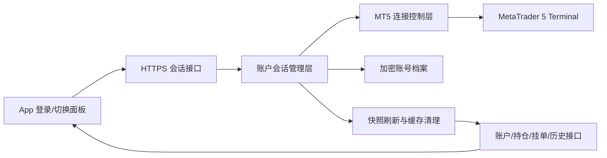
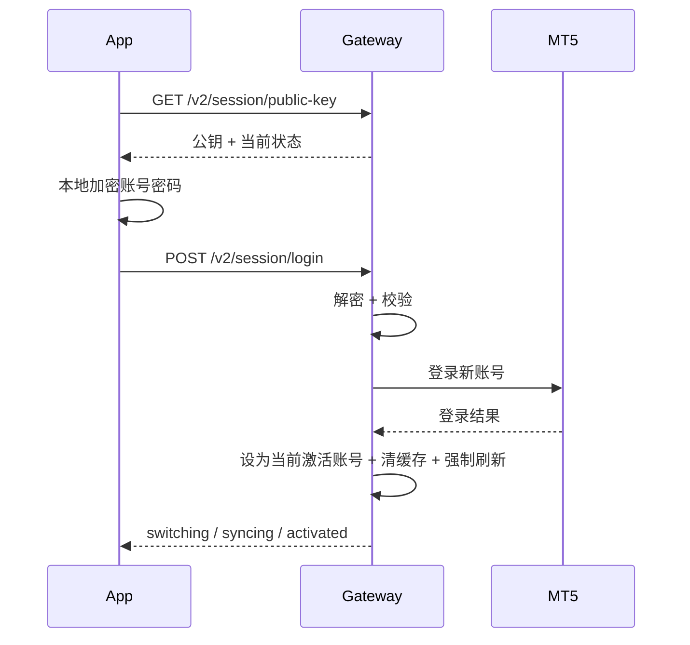

# App 远程驱动服务器切换 MT5 账号设计

## 1. 背景

当前项目里，服务器端 MT5 网关通过 `mt5_gateway/.env` 中的固定账号登录 MT5，App 端虽然有“登录账户”交互，但本质上只是本地保存一组账号信息，再用这组信息和网关返回的账户做匹配校验。  
这意味着：

- 服务器真正连接哪个 MT5 账号，当前只能靠手工改 `.env`
- App 端不能真正远程驱动服务器切换账号
- 账号密码目前不适合做远程切换，因为缺少安全传输和服务器端安全保存机制

本设计的目标，是把它升级成：

- App 可以远程安全登录 / 切换 / 退出 MT5 账号
- 传输链路不直接发送明文密码
- 服务器支持“仅本次使用”和“加密保存后切换复用”
- 任意时刻服务器只允许一个当前激活账号
- 切换账号后，行情、持仓、挂单、交易上下文统一切到新账号

## 2. 本次设计结论

### 2.1 推荐方案

采用：

- HTTPS 作为基础传输层
- App 使用服务器公钥加密登录凭据后提交
- 服务器解密后执行 MT5 登录
- 用户可选择“仅本次使用”或“记住此账号”
- 服务器端用本机密钥加密保存账号档案
- 任意时刻只保留一个当前激活账号

### 2.2 为什么选这个方案

它是当前代码结构下的最短正确路径。

- 不需要推翻现有“服务器登录 MT5、App 通过网关访问”的主架构
- 可以把“手工改 `.env` 切账号”升级为“App 远程切账号”
- 能满足密码不明文传输、不明文落盘
- 单用户、多账号、单激活会话，复杂度可控

## 3. 已排除方案

### 3.1 方案 A：服务器公钥加密 + 服务端加密保存

这是推荐方案，已采用。

优点：

- 安全边界清晰
- 兼容“仅本次”和“记住账号”
- 与当前网关结构耦合最小

代价：

- 需要补一套账户会话接口
- 需要补服务器端凭据加密保存机制

### 3.2 方案 B：App 本地记住密码，每次切换都重新发服务器

优点：

- 服务器端实现最简单

缺点：

- 用户体验差
- 多设备场景下复用差
- “记住账号”价值有限

本设计不采用。

### 3.3 方案 C：多账号同时在线 / 多用户会话池

优点：

- 长期扩展性更强

缺点：

- 与当前单账户快照、图表、交易上下文模型冲突较大
- 会明显增加状态复杂度和实盘风险

本设计不采用。

## 4. 范围与边界

### 4.1 本次要做

- App 远程发起登录、切换、退出 MT5 账号
- 服务器维护单一当前激活账号
- 登录凭据加密传输
- 服务器端加密保存账号档案
- 切换后强制刷新账户快照
- App 侧清晰展示账号状态与切换过程
- 失败时保留旧账号或回到未登录态，不进入伪成功状态

### 4.2 本次不做

- 多用户隔离
- 多账号同时在线
- 云端账号同步
- 生物识别解锁
- 完整权限系统
- 高级密钥轮换后台

## 5. 使用场景

### 5.1 新账号临时登录

用户在 App 输入账号、密码、服务器，选择“仅本次使用”，App 安全提交到服务器。  
服务器登录成功后，把该账号设为当前激活账号，但不落盘保存密码。服务重启后需要重新登录。

### 5.2 新账号登录并记住

用户输入账号、密码、服务器，并勾选“记住此账号”。  
服务器登录成功后，把该账号设为当前激活账号，并把凭据加密保存，供后续切换复用。

### 5.3 在已保存账号之间切换

用户在 App 的已保存账号列表点击另一个账号。  
服务器解密对应账号档案，重新连接 MT5，切换成功后刷新快照并回写 App。

## 6. 总体架构



整体原则：

- 账号切换单独走“账户会话管理层”
- 市场、账户、交易接口只读取“当前激活账号”的结果
- 凭据的接收、解密、保存、删除，不混进普通行情接口

## 7. 服务器侧核心对象

### 7.1 ActiveMt5Session

表示当前唯一激活账号。

建议字段：

- `profileId`
- `login`
- `loginMasked`
- `server`
- `displayName`
- `connected`
- `activatedAt`
- `lastSyncAt`
- `source`

### 7.2 StoredAccountProfile

表示一个已保存账号档案。

建议字段：

- `profileId`
- `displayName`
- `loginMasked`
- `server`
- `encryptedSecret`
- `createdAt`
- `lastUsedAt`

### 7.3 LoginEnvelope

表示 App 发来的加密登录包。

建议字段：

- `requestId`
- `keyId`
- `algorithm`
- `encryptedKey`
- `encryptedPayload`
- `iv`
- `clientTime`

### 7.4 SessionOperationReceipt

表示一次登录、切换、退出操作的结果。

建议字段：

- `requestId`
- `operation`
- `state`
- `accountProfileId`
- `startedAt`
- `finishedAt`
- `message`
- `errorCode`

## 8. 接口设计

### 8.1 `GET /v2/session/public-key`

用途：返回当前公钥和会话摘要。

返回建议：

```json
{
  "ok": true,
  "keyId": "key-20260406-01",
  "algorithm": "rsa-oaep+aes-gcm",
  "publicKeyPem": "-----BEGIN PUBLIC KEY-----...",
  "expiresAt": 1775400000000,
  "activeAccount": {
    "profileId": "acc_01",
    "loginMasked": "****5678",
    "server": "ICMarketsSC-MT5-6",
    "displayName": "IC 5678",
    "state": "active"
  },
  "savedAccounts": [
    {
      "profileId": "acc_01",
      "loginMasked": "****5678",
      "server": "ICMarketsSC-MT5-6",
      "displayName": "IC 5678",
      "isActive": true
    }
  ]
}
```

### 8.2 `POST /v2/session/login`

用途：登录新账号，并可选择是否保存。

请求建议：

```json
{
  "requestId": "uuid",
  "keyId": "key-20260406-01",
  "algorithm": "rsa-oaep+aes-gcm",
  "encryptedKey": "...",
  "encryptedPayload": "...",
  "iv": "...",
  "saveAccount": true,
  "deviceName": "Pixel 8"
}
```

服务器解密后得到原始载荷：

```json
{
  "login": "12345678",
  "password": "your_password",
  "server": "ICMarketsSC-MT5-6",
  "remember": true,
  "nonce": "uuid",
  "clientTime": 1775400000000
}
```

### 8.3 `POST /v2/session/switch`

用途：切换到已保存账号。

请求建议：

```json
{
  "requestId": "uuid",
  "accountProfileId": "acc_02"
}
```

### 8.4 `POST /v2/session/logout`

用途：退出当前激活账号并清理会话态。

### 8.5 `GET /v2/session/status`

用途：读取当前账号状态，供 App 刷新页面。

### 8.6 `GET /v2/session/accounts`

用途：读取已保存账号列表摘要。

### 8.7 `DELETE /v2/session/accounts/{id}`

用途：删除某个已保存账号。

删除当前激活账号时，先退出登录，再删除档案。

## 9. 标准返回结构

### 9.1 成功响应

```json
{
  "ok": true,
  "state": "activated",
  "requestId": "uuid",
  "account": {
    "profileId": "acc_01",
    "login": "12345678",
    "loginMasked": "****5678",
    "server": "ICMarketsSC-MT5-6",
    "displayName": "IC 5678"
  },
  "sync": {
    "status": "refreshing",
    "syncToken": "sync-token"
  },
  "message": "登录成功，正在同步账户数据"
}
```

### 9.2 失败响应

```json
{
  "ok": false,
  "state": "failed",
  "requestId": "uuid",
  "errorCode": "MT5_LOGIN_FAILED",
  "message": "账号、密码或服务器错误",
  "retryable": false
}
```

## 10. App 侧交互设计

App 端“账户登录”交互升级为“账户会话面板”，至少包含三块：

### 10.1 当前账号卡片

显示：

- 当前是否已连接
- 当前激活账号尾号
- 当前服务器
- 当前状态：未登录 / 切换中 / 同步中 / 已激活 / 失败

### 10.2 新增账号入口

表单字段：

- 账号
- 密码
- 服务器
- 仅本次使用
- 记住此账号

### 10.3 已保存账号列表

每项显示：

- 昵称
- 账号尾号
- 服务器
- 最近使用时间
- 当前激活标记
- 切换按钮
- 删除按钮

## 11. App 侧状态机

建议状态：

- `idle`
- `encrypting`
- `submitting`
- `switching`
- `syncing`
- `active`
- `failed`

规则：

- 只有进入 `active` 才算真正切换成功
- `switching` 和 `syncing` 期间，交易按钮默认禁用
- `failed` 时不允许残留伪成功 UI

## 12. 登录与切换流程

### 12.1 新账号登录



### 12.2 已保存账号切换

- App 读取已保存账号列表
- 用户点击某个账号
- 服务器解密该账号档案
- 服务器重新连接 MT5
- 切换成功后清旧缓存并全量刷新

## 13. 失败回退机制

### 13.1 提交前失败

例如公钥过期、表单不完整、本地加密失败。  
处理：不改变当前激活账号。

### 13.2 服务器解密或校验失败

例如密文损坏、请求超时、重放请求。  
处理：不改变当前激活账号。

### 13.3 MT5 登录失败

例如账号错误、密码错误、服务器名错误、MT5 客户端未启动。  
处理：旧账号保持不变；若原本无账号，则保持未登录。

### 13.4 登录成功但同步失败

例如 MT5 已切到新账号，但快照刷新超时。  
处理：服务器状态标记为“已切换但数据未就绪”；App 显示同步失败，不允许直接发交易命令。

## 14. 页面回退与缓存清理

切换账号时必须做这些清理：

- 清空旧账号交易草稿
- 清空图表订单线
- 清空挂单详情展开态
- 清空账户缓存 token
- 暂停自动刷新
- 新账号 `syncToken` 回来后再恢复刷新

这样可以避免旧账号仓位、挂单、止盈止损线误显示到新账号页面。

## 15. 安全机制

### 15.1 传输层

公网入口必须使用 HTTPS。

没有 HTTPS，不应开启远程账号登录与切换。

### 15.2 应用层

App 使用服务器公钥加密敏感凭据后再提交。

推荐做法：

- App 生成一次性随机密钥
- 用随机密钥加密账号密码
- 再用服务器公钥包裹这个随机密钥

### 15.3 服务器保存层

如果用户勾选“记住此账号”，服务器只保存加密后的账号档案。  
推荐使用 Windows DPAPI 作为落盘保护能力。

### 15.4 使用控制层

- 任意时刻只允许一个激活账号
- 登录和切换都必须带 `requestId`
- 所有关键操作写审计日志

## 16. 持久化结构

建议先使用文件目录，不立即引入数据库：

```text
mt5_gateway/
  data/
    session/
      active_session.json
      accounts/
        acc_01.json
        acc_02.json
```

说明：

- `active_session.json` 只存当前会话摘要，不存明文密码
- `accounts/*.json` 存加密档案
- 真正的解密能力依赖服务器本机密钥

## 17. 与现有模块的关系

### 17.1 服务器侧

需要补：

- 会话管理模块
- 密钥与加密工具模块
- 账号档案存储模块
- 会话接口路由

保留：

- 现有 `server_v2.py` 的市场、账户、交易接口主干
- 现有 MT5 直连和交易能力

### 17.2 App 侧

需要补：

- 公钥获取与凭据加密
- 远程会话接口客户端
- 账户会话面板
- 切换状态机
- 切换后的缓存清理与 UI 回退

保留：

- 现有账户页、图表页、交易命令链
- 现有交易确认与同步逻辑主方向

## 18. 测试重点

### 18.1 加密与传输

- 公钥获取正确
- 加密包结构正确
- 错误 `keyId` 失败
- 过期时间戳失败
- 重复请求不重复执行

### 18.2 登录与切换

- 新账号登录成功
- 新账号登录失败不影响旧账号
- 已保存账号切换成功
- 切换不存在账号失败
- 删除当前账号时能正确退出

### 18.3 状态机

- `encrypting -> submitting -> switching -> syncing -> active`
- 任一步失败都进入 `failed`
- 失败后 UI 不残留伪成功状态

### 18.4 缓存与回退

- 切换后旧持仓和挂单不再展示
- 新账号快照回来后才恢复页面
- 同步失败时不误展示旧账号数据

### 18.5 安全与落盘

- 服务器不保存明文密码
- 删除账号后密文档案被删除
- 服务重启后已保存账号可重新解密使用
- 未勾选“记住账号”时，重启后不残留凭据

## 19. 分阶段落地顺序

### 阶段 A：打通最小安全登录闭环

- HTTPS
- 公钥下发
- App 加密登录
- 服务器解密并登录 MT5
- 当前激活账号状态接口
- 退出登录

### 阶段 B：补账号切换与已保存账号

- 服务器端加密保存账号档案
- 已保存账号列表
- 切换已保存账号
- 删除已保存账号
- App 会话面板

### 阶段 C：补切换后的强一致同步

- 切换后清缓存
- 强制全量刷新
- App 状态机完整化
- 图表 / 持仓 / 挂单统一切到新账号

### 阶段 D：补审计与安全收口

- 登录 / 切换 / 删除审计日志
- 公钥过期与轮换
- 失败告警
- 管理面板显示当前激活账号和已保存账号摘要

## 20. 成功标准

满足以下条件才算完成：

- 用户能在 App 中安全登录新 MT5 账号
- 用户能在 App 中切换已保存账号
- 密码不以明文形式在公网请求体中传输
- 服务器不以明文形式持久化保存密码
- 任意时刻服务器只有一个当前激活账号
- 切换成功后，账户、持仓、挂单、图表、交易命令都统一对齐到新账号
- 任一步失败时，不出现“看起来成功、实际上没切过去”的伪成功状态

## 21. 关键风险

- HTTPS 没有真正收口前，不应开放远程账号切换
- 如果切换后缓存清理不彻底，容易把旧账号数据误展示到新账号页面
- 如果“登录成功”和“同步完成”没有拆开，用户会误判账号已经可交易
- 如果服务器端明文保存凭据，即使传输层安全，整体仍不安全

## 22. 最终结论

本设计采用“HTTPS + 服务器公钥加密登录 + 服务端加密保存账号档案 + 单激活账号会话”的方案。  
它兼容“仅本次使用”和“记住账号”两种模式，并保持当前实盘终端架构的核心不变：服务器仍是唯一 MT5 执行主体，App 负责安全发起会话控制、展示状态和接收同步结果。  
在当前项目阶段，这是安全、复杂度、可落地性三者之间最平衡的方案。
